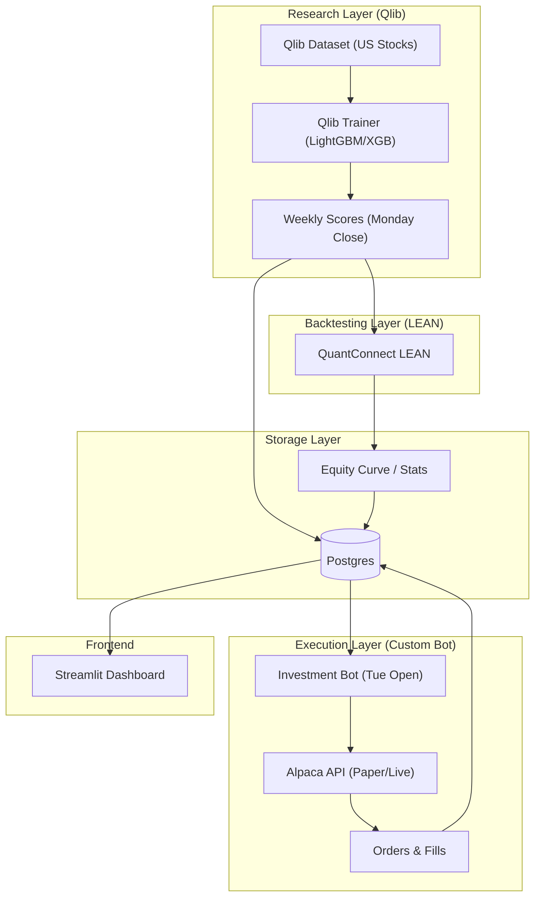

# Architecture & Framework Integration

## Overview
This system combines custom execution logic with industry-grade open-source frameworks for research and backtesting.

### Component Responsibilities

| Framework | Responsibility | Key Output |
| :--- | :--- | :--- |
| **Microsoft Qlib** | ML Research & Signal Generation | Weekly cross-sectional scores as-of Monday close |
| **QuantConnect LEAN** | Rigorous Backtesting & Strategy Validation | Backtest reports (JSON/CSV) exported to Postgres |
| **Custom Bot (src/)** | Execution & Risk Management | Orders placed via Alpaca API |
| **Postgres** | Single Source of Truth | Ledger, scores, positions, and performance metrics |
| **Streamlit** | Visualization & Transparency | Dashboard for performance and decision auditing |

## Component Diagram

## Future Frontend Path
The current Streamlit app reads directly from Postgres. The planned migration to a **Next.js** frontend will involve:
1. Creating a **FastAPI** layer that wraps the Postgres DB.
2. Building a Next.js dashboard that consumes the FastAPI endpoints.
3. Decoupling the Streamlit-specific logic into reusable service functions.

